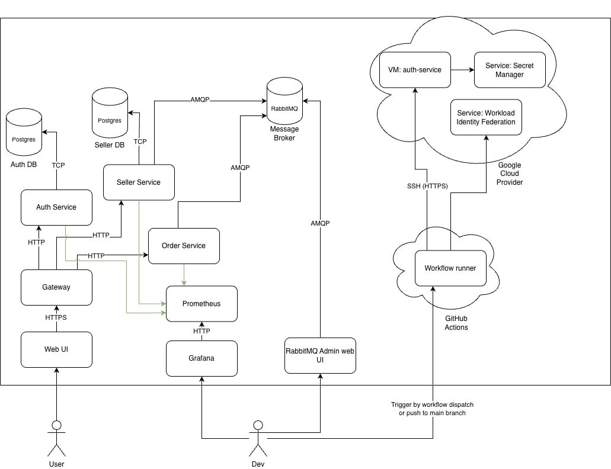

# Marketplace platform

By

- Dobrojan Alexandru
- Vacarciuc Ion
- Macarie Ion

## Overview

This projects presents a POC for a distributed online marketplace platform, with data-heavy flows.
The user accesses a web UI dashboard, after authentication, they see a list of available products,
they can fill a shopping cart with products, then place an order, the order is processed and simulates
a delivery to the physical address of the customer.

## Architecture

The system is designed in a microservice architecture. The microservices are: auth service, seller service and order
service. Each microservice has its own database instance. A gateway is connected to each microservice and provides
endpoint authentication/authorization. API versioning is used for each endpoint in the system, defaulting to v1.

The following diagram depicts a high-level overview of the system architecture:

## CI/CD

The CI/CD approach is used in order to test and deploy the system. The CI/CD is defined in .github/workflows folder, by
using github actions on free runners. The deployment is done using `gcloud` CLI and is used to authenticate to Google
Cloud Provider, push to Artifact Registy the freshly built docker image(s), ssh to the Compute Image VM(s) and pull and
run the images. The actions as well run in parallel all the unit tests, integration tests and end-to-end tests from all
microservices on branch pushes and pull requests.

## Technologies

This project was built using JavaScript ecosystem, namely NestJS backend framework and React for the frontend. For
consistency, all microservices are implemented with the same NodeJS version 24 and the same versions of NestJS, so its
easy to reuse components and have similar approaches to each microservice for developemnt and deployment.

For the communication, we are using RabbitMQ message queue, that ensures message durability at downtime, dead letter
exchanges and ack/nack mechanisms.

For the metrics, we use Prometheus that collects data from each microservice, gateway, database, rabbitmq at once, then
grafana pulls the metrics and builds relevant visualizations.

Docker is used for the containerization of each service and infrastructure node for consistency and reliability.

PNPM workspaces feature is used to manage the monorepo, that allows managing the dependencies and scripts of each app
individually, and defining shared configuration/dependecies/scripts.

For data persistence Postgres database management system was used for each microservice.

## Security

The security was approached using stateless JWT token authentication technique. The authorization/authentication is
managed by Auth Service, that exposes endpoints for user management, login, registration, checking token validity. This
microservice is used directly by the gateway. The gateway uses custom decorators and guards to set up the security for
each endpoint separately, defining public and protected routes and roles required for each endpoint. The JWT secret and
additional properties like TTL are read from the environment, that is set from .env files in order to ensure that the
details are not publicly exposed as strings. The JWT token contains data in form of claims such as the role, the
principal info like the subject field, the timestamp when it was issued and the timestamp when it expires.

During deployment, short lived auth token is issued by github in order to authenticate the gcloud using a service
account, that service account then pulls from Google Secret Manager all the required secrets and safely injects them
into the environment.

The Compute Engine VMs are being connected to using secure SSH, they have only one public key that allows only one
machine to connect to them, other than the service account crated from the Workload Identity Google service.

## How to run

The system can be run locally in 2 modes: development and production. Prerequisites:

- docker
- docker compose plugin
- .env.<mode> files in each project

In order to run the system development mode, in root run in terminal: `./dev.sh`. \
In order to run the system production mode, in root run in terminal: `./prod.sh`. \
The system can also be launched manually using docker compose CLI:
`docker compose --file compose.<mode>.yml --env-file .env.<mode> up`. \
No additional setup needed.

## Endpoints

The auth service that is deployed in the cloud can be accessed at `http://34.32.127.183:3000/api/docs` \
The gateway locally can be accessed at `http://localhost:3000/api/docs`
