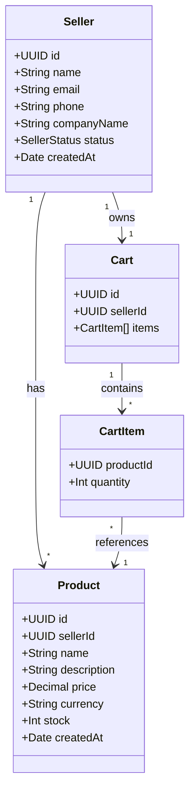

# Seller Service
## Descriere
Microserviciu responsabil pentru gestionarea vânzătorilor, produselor și coșurilor lor.  
Integrare RabbitMQ pentru evenimente cu contextul vânzătorului (sellerId, cartId).
## Tehnologii
- **NestJS** - Framework backend
- **PostgreSQL** - Database
- **TypeORM** - ORM
- **RabbitMQ** - Message broker
- **Swagger** - API documentation
- **Jest** - Testing
## Entități
### Seller
- `id` - UUID
- `name` - Nume vânzător
- `email` - Email (unic)
- `phone` - Telefon (opțional)
- `companyName` - Nume companie
- `status` - Status (active/inactive)
- `createdAt` - Data creării
### Product
- `id` - UUID
- `sellerId` - UUID (FK către Seller)
- `name` - Nume produs
- `description` - Descriere (opțional)
- `price` - Preț
- `currency` - Monedă (default: USD)
- `stock` - Stoc
- `createdAt` - Data creării
### Cart
- `id` - UUID
- `sellerId` - UUID (unic, FK către Seller)
- `items` - Array de CartItem (productId, quantity)
## API Endpoints
### Sellers
| Method | URL          | Body                                            | Description             |
| ------ | ------------ | ----------------------------------------------- | ----------------------- |
| POST   | /sellers     | `{name, email, phone?, companyName}`            | Creare vânzător         |
| GET    | /sellers     | -                                               | Listă vânzători         |
| GET    | /sellers/:id | -                                               | Obține vânzător după ID |
| PUT    | /sellers/:id | `{name?, email?, phone?, status?}`              | Actualizează vânzător   |
| DELETE | /sellers/:id | -                                               | Șterge vânzător         |
### Products
| Method | URL                   | Body                                                    | Description                 |
| ------ | --------------------- | ------------------------------------------------------- | --------------------------- |
| POST   | /products             | `{sellerId, name, price, stock, currency?, description?}` | Creare produs               |
| GET    | /products/:id         | -                                                       | Obține produs               |
| PUT    | /products/:id         | `{name?, price?, stock?, description?}`                 | Actualizare produs          |
| DELETE | /products/:id         | -                                                       | Ștergere produs             |
| GET    | /sellers/:id/products | -                                                       | Listă produse pentru seller |
### Cart
| Method | URL                             | Body                        | Description               |
| ------ | ------------------------------- | --------------------------- | ------------------------- |
| GET    | /sellers/:id/cart               | -                           | Obține coșul vânzătorului |
| POST   | /sellers/:id/cart/items         | `{productId, quantity}`     | Adaugă item în coș        |
| PUT    | /sellers/:id/cart/items         | `{productId, quantity}`     | Actualizează cantitate    |
| DELETE | /sellers/:id/cart/items/:itemId | -                           | Șterge item din coș       |
## RabbitMQ Events
Toate evenimentele sunt publicate în exchange-ul `seller-events` (tip: topic).
### product.created
```json
{
  "event": "product.created",
  "context": {
    "sellerId": "uuid",
    "cartId": "uuid"
  },
  "data": {
    "productId": "uuid",
    "name": "Laptop",
    "price": 1200,
    "sellerId": "uuid"
  },
  "timestamp": "2026-03-10T10:00:00Z"
}
```
### product.stock.updated
```json
{
  "event": "product.stock.updated",
  "context": {
    "sellerId": "uuid",
    "cartId": "uuid"
  },
  "data": {
    "productId": "uuid",
    "stock": 10,
    "previousStock": 5
  },
  "timestamp": "2026-03-10T10:00:00Z"
}
```
### cart.updated
```json
{
  "event": "cart.updated",
  "context": {
    "sellerId": "uuid",
    "cartId": "uuid"
  },
  "data": {
    "cartId": "uuid",
    "sellerId": "uuid",
    "itemCount": 3
  },
  "timestamp": "2026-03-10T10:00:00Z"
}
```
### cart.item.removed
```json
{
  "event": "cart.item.removed",
  "context": {
    "sellerId": "uuid",
    "cartId": "uuid"
  },
  "data": {
    "cartId": "uuid",
    "sellerId": "uuid",
    "itemCount": 2
  },
  "timestamp": "2026-03-10T10:00:00Z"
}
```
## Instalare și Rulare
### Prerequisites
- Node.js 18+
- PostgreSQL
- RabbitMQ
### Setup
1. Instalare dependențe:
```bash
pnpm install
```
2. Configurare variabile de mediu (copiază .env.example în .env):
```bash
cp .env.example .env
```
3. Rulare în modul development:
```bash
pnpm start:dev
```
4. Rulare teste:
```bash
# Unit tests
pnpm test
# E2E tests
pnpm test:e2e
# Test coverage
pnpm test:cov
```
## Swagger Documentation
URL: `http://localhost:3002/api/docs`
Documentația interactivă Swagger include toate endpoint-urile cu exemple de request/response.
## Arhitectură
```
seller-service
│
├── application
│   └── use-cases          # Business logic
│       ├── seller.usecase.ts
│       ├── product.usecase.ts
│       └── cart.usecase.ts
│
├── domain
│   ├── entities           # Database entities
│   │   ├── seller.entity.ts
│   │   ├── product.entity.ts
│   │   └── cart.entity.ts
│   └── repositories       # Data access layer
│       ├── seller.repository.ts
│       ├── product.repository.ts
│       └── cart.repository.ts
│
├── infrastructure
│   ├── controllers        # HTTP endpoints
│   │   ├── seller.controller.ts
│   │   ├── product.controller.ts
│   │   └── cart.controller.ts
│   └── config            # Configuration files
│       ├── typeorm.config.ts
│       └── swagger.config.ts
│
├── messaging
│   └── rabbitmq          # Event publishing
│       ├── publisher.ts
│       ├── event.types.ts
│       └── rabbitmq.module.ts
│
└── dto                   # Data transfer objects
    ├── seller.dto.ts
    ├── product.dto.ts
    └── cart.dto.ts
```
## Schemă Simplificată

## Environment Variables
| Variable      | Description               | Default             |
| ------------- | ------------------------- | ------------------- |
| PORT          | Server port               | 3002                |
| NODE_ENV      | Environment               | development         |
| DB_HOST       | PostgreSQL host           | localhost           |
| DB_PORT       | PostgreSQL port           | 5432                |
| DB_USERNAME   | PostgreSQL username       | postgres            |
| DB_PASSWORD   | PostgreSQL password       | postgres            |
| DB_NAME       | Database name             | seller_service      |
| RABBITMQ_URL  | RabbitMQ connection URL   | amqp://localhost:5672 |
## License
UNLICENSED
